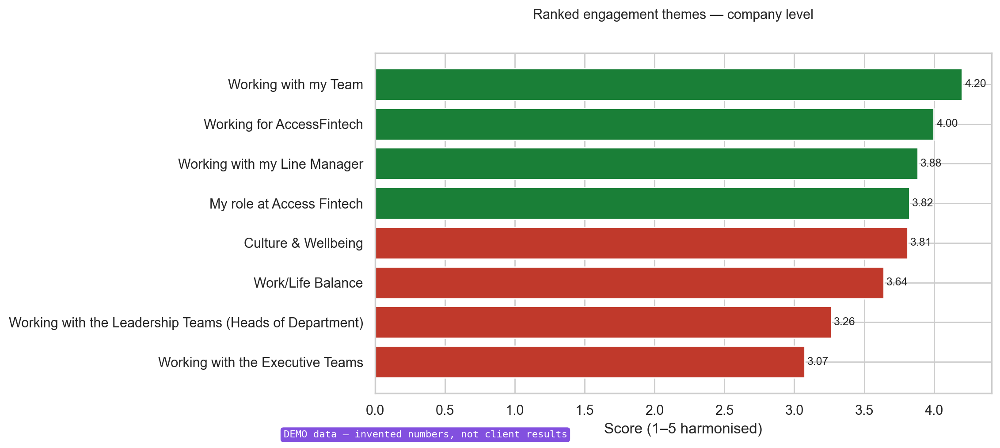
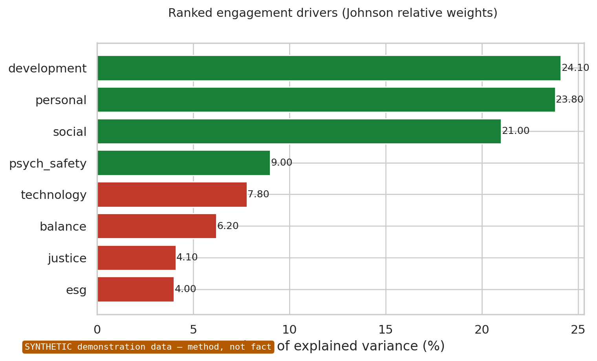
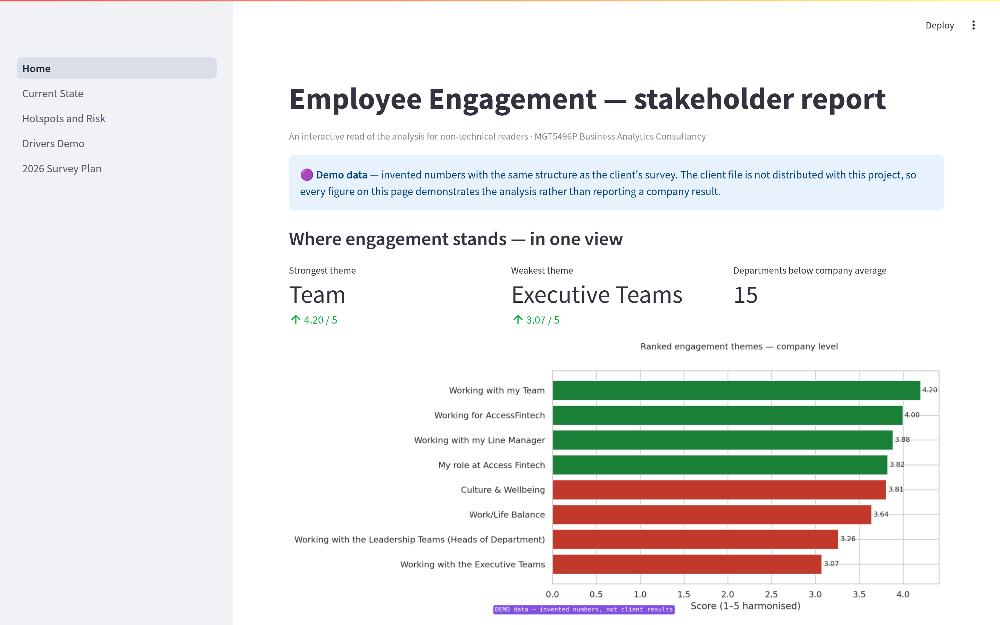

# Employee Engagement Analytics — diagnostic, synthetic demonstration, survey redesign

A two-phase analytics consultancy project for a fintech client: diagnose what an aggregated
employee-engagement survey **can** support, demonstrate on synthetic data what better data
**would** unlock, and convert the gap between the two into a redesigned 2026 instrument.

Built as an end-to-end Python package with a one-command pipeline, a tested synthetic-data
generator with blocking quality gates, and data-provenance controls enforced in code.

> **Runs out of the box.** The client's survey is not redistributable, so this repository ships a
> fabricated stand-in with the same structure and invented numbers. `make all` reproduces every
> figure and table below in about two minutes. See [Data governance](#data-governance).

<p align="center">
  
  
</p>

---

## The problem

The client supplied a single spreadsheet: one wave, 107 respondents, **already aggregated**. Item
means for the company, and every department stored as a *delta* from that mean. No individual
responses, no demographics, no time dimension, and an empty `manager` column.

Stakeholders wanted drivers of engagement, attrition risk scores, employee segments, and trends.
**None of those are answerable from that file**, not because of method, but because the data
elements they require were never collected.

The project's argument is built on taking that seriously rather than working around it.

| Phase | Question | Data | What it may claim |
|---|---|---|---|
| **1 — Diagnostic** | Where does engagement stand, and where are the gaps? | Real aggregated survey | Description only, bounded explicitly |
| **2 — Demonstration** | What would individual-level, multi-wave data unlock? | Synthetic panel, 1,000 employees × 3 waves | Method capability, never company fact |
| **3 — Synthesis** | What must the 2026 survey collect? | Both | A specification, traceable to a measured gap |

The most important output is Phase 3. Every change proposed for the 2026 survey is backed by
evidence from the analysis in Phases 1 and 2, so each recommendation follows logically from the
data rather than from opinion.

**Why three phases.** The logic is a clinician's. The company's engagement is the patient, and the
2024 survey is a partial medical record. Phase 1 examines the patient on the records available.
Phase 2 builds a simulated patient with the same profile, to show what a full record would reveal.
Phase 3 compares the two: what can be treated now, and what has to be recorded differently next
time.

## What the project was asked to do

The client set four objectives. Two of them could not be answered from the data supplied, so each
was refined into a version that stays answerable on an evidence base that actually exists. That
refinement is the project's argument, not a workaround.

| | Client asked for | Refined into | Why the refined version delivers more |
|---|---|---|---|
| **RO1** | Analyse prior survey data for trends, themes and problem areas | Diagnose the 2024 profile: rank the eight themes, benchmark every department, locate the problem areas. Real data. | One wave cannot show a trend, but it sets the benchmark that later waves are measured against |
| **RO2** | Statistical and ML models for the strongest predictors of engagement | Build and validate a driver-analysis pipeline on data fit for that purpose. Synthetic data. | Aggregated means cannot support credible modelling. Proving the pipeline on calibrated synthetic data means it is ready the moment real responses exist |
| **RO3** | Identify disengagement risk across roles, teams and regions | (a) Flag the risk the real data can show; (b) demonstrate an explainable risk model for use once richer data exists. Both. | No group can be profiled without demographics. The model outlasts the profile: at-risk groups change every wave, the model does not |
| **RO4** | Design a data-driven 2026 survey | Deliver a redesigned 2026 survey together with the reproducible pipeline that reads it | A questionnaire alone leaves the client dependent on outside analysis. Pairing it with the pipeline builds in-house capability |

The notebooks refer to these as RO1–RO4. `outputs/tables/tab23_traceability.csv` traces every
deliverable in the project back to one of them.

## What this demonstrates

| Area | In this repository |
|---|---|
| **Data engineering** | Schema validation that fails loudly on a changed file; delta→absolute reconstruction; mixed-scale harmonisation; tidy reshaping; a config-driven package with zero magic numbers in analysis code |
| **Statistics** | Dispersion screening, hierarchical clustering with silhouette-based model selection, PCA, importance–performance analysis with a circularity correction, Cronbach's α, correction for measurement attenuation |
| **Machine learning** | Johnson relative-weights driver analysis, imbalanced classification with temporal validation and threshold tuning, SHAP explanations, k-means segmentation held to a stated standard |
| **Synthetic data** | Gaussian-copula generator calibrated to real aggregates, with **two blocking quality gates**, fidelity and plausibility that fail the run rather than warn |
| **Software practice** | `src/` package, `pytest` suite on the correctness-critical transforms, one-command reproducible pipeline, pinned dependencies, generated provenance manifest |
| **Judgement & communication** | Each analysis starts with a short note explaining what it does, why this method was chosen, what other options were ruled out, and what it leads to; the code itself prevents any result from claiming more than the data can show; a four-page Streamlit app explains the results in plain language for non-technical readers |

## Three things worth looking at

**1. Every chart shows where its data came from.** All figures are saved through one function,
`viz.save_figure`. It adds a label to each chart (REAL, SYNTHETIC or DEMO) and will not save a
chart unless its data source is stated. When the pipeline runs on the demo data, REAL labels
switch to DEMO automatically, so a public copy of this project can never show a chart that
claims to use real client data.

**2. Quality checks that stop the run.** The synthetic data is tested, not just assumed to be
fine. Check 1 confirms that each department's scores match their targets and that departments
are ranked in exactly the same order. Check 2 confirms that the relationships between measures,
taken from published research, are still present in the generated data. If either check fails,
the pipeline stops. `tests/test_synthetic.py` confirms that this actually happens.

**3. Negative results are reported honestly.** The clustering found no clear groups of
departments, and the analysis says so. The employee segmentation was held to the same standard
and also found no clear groups. The importance–performance map uses only about 19 data points,
so it is labelled exploratory and its three weaknesses are listed. Good analysis reports what
the data shows, not what the project hopes to find.

---

## Quick start

There are three ways in, depending on how much time you have. None of them needs the client's data.

| You want to… | Do this | Time |
|---|---|---|
| **Read** the analysis | Open `outputs/notebooks_html/` in a browser. No installation. | 10 min |
| **Browse** the results as a stakeholder would | `make install` once, then `make app` | 2 min to set up |
| **Rebuild** every figure and table yourself | `make install` once, then `make all` | ~2 min to run |

Python 3.10+ is needed for the last two. All commands run from the project root.

```bash
make install     # once: install the dependencies and the package
make app         # open the stakeholder report at http://localhost:8501 (Ctrl+C to stop)
make test        # 6 tests on the correctness-critical transforms
make pipeline    # execute notebooks 01-06, export HTML, write the manifest
make all         # test, then pipeline
make help        # list every command
```

The repository ships with the outputs already built, so `make app` works straight after
`make install`. Outputs land in `outputs/figures/`, `outputs/tables/` and
`outputs/notebooks_html/`. `make demo-data` rewrites the demo workbook if you ever need a fresh
copy; it is already committed.

**A ten-minute reading route** through `outputs/notebooks_html/`, and what to look for at each stop:

| Read | Question it answers | What to look for |
|---|---|---|
| `01` | What is wrong with the data, and what does that allow? | The two scale defects found in the workbook, and the boundary statement they lead to |
| `03` | Do departments form groups? How many things does the survey really measure? | A negative result reported as a result, and the halo finding tested twice by two methods |
| `06` | What must the 2026 survey collect? | Every proposed change traced back to an analysis that failed for a missing data element |

Read `02`, `04` and `05` as well for the full argument: `02` is the diagnostic, `04` builds and
tests the synthetic data, `05` runs the analysis the real data cannot support.

## The stakeholder app

The notebooks are written for analysts. `app/` is a four-page Streamlit report for decision-makers,
such as the HR Director, People & Culture leads, department heads and the leadership team. They
will not work with the code; they need clear numbers and charts to decide where to act.

<p align="center">
  
</p>

| Page | Question | Data |
|---|---|---|
| Home | Where does engagement stand? | Survey |
| 1 · Current State | Which departments diverge, and on what? | Survey |
| 2 · Hotspots & Risk | Which problems are company-wide, and which are local? | Survey |
| 3 · Drivers | What actually drives engagement? | Synthetic |
| 4 · 2026 Survey Plan | So what do we change? | Both |

The app follows two design rules:

1. **It only reads results, it never recalculates them.** Every number comes from the CSV files
   the pipeline creates, so the app always matches the notebooks.
2. **Every page says where its data comes from.** A notice at the top of each page shows whether
   the numbers are REAL, DEMO or SYNTHETIC. It uses the same setting as the chart labels, so the
   app can never present demo numbers as real client data.

Each panel is followed by a plain-language *what this means*, including where the honest reading
is a negative one, such as the department clustering that found no archetypes.

## The six notebooks

| # | Notebook | Question |
|---|---|---|
| 01 | `01_data_loading_quality.ipynb` | Is the data loaded correctly, and what is wrong with it? |
| 02 | `02_phase1_diagnostic.ipynb` | Where does engagement stand, and where are the gaps? |
| 03 | `03_phase1_multivariate.ipynb` | Do departments form groups? How many things does the survey measure? |
| 04 | `04_synthetic_generation_validation.ipynb` | Can we build the data the survey is missing, and prove it is sound? |
| 05 | `05_phase2_modelling.ipynb` | What would better data unlock: drivers, risk, segments, trends? |
| 06 | `06_phase3_synthesis.ipynb` | What must the 2026 survey collect? |

Each notebook follows the same structure: a header stating what it does, a **decision box** before
every analysis, the code and its results, then a short interpretation of the result. The notebooks
focus on the author's analysis and insights. The functions, algorithms and logic behind them live
in `src/engagement/`, where each one is explained.

## How the code is organised

```
config/config.yaml    every parameter: paths, seed, thresholds, provenance
src/engagement/       all analysis code
notebooks/            the six notebooks; they call src/
app/                  Streamlit stakeholder report; reads outputs/, recomputes nothing
scripts/              run_pipeline.py · make_demo_workbook.py
tests/                6 tests on the transforms where a silent error would spoil everything
outputs/              figures, tables, rendered HTML, run manifest
data/                 raw (demo workbook), processed, synthetic
```

| Module | Responsibility |
|---|---|
| `config.py` | Loads and validates `config.yaml`; resolves paths from the repo root |
| `io.py` | Reads the workbook, validates its structure, reshapes it to tidy long format |
| `quality.py` | Delta→absolute reconstruction, scale harmonisation, structural audit, Cronbach's α |
| `phase1.py` | Rankings, gap matrix, dispersion screen, clustering, PCA, IPMA, composite index |
| `synthetic.py` | Copula generator, calibration, and the two blocking quality gates |
| `models.py` | Reliability, driver analysis, risk models, SHAP explanations |
| `personas.py` | Segmentation, held to the Phase 1 standard |
| `synthesis.py` | Phase comparison, priority map, the 2026 instrument specification |
| `viz.py` | House chart style and the provenance badge every figure passes through |

Every function carries a plain-English **"How it works"** description written as numbered steps.

## Tests

```bash
make test
```

There are six tests. Each one checks a key step where a hidden error would break every result
that comes after it. Every check is tested both ways: it must accept correct data and reject
wrong data.

| Test | What it proves |
|---|---|
| Reconstruction | Delta + company mean recovers the absolute score, and the step loses no information |
| Harmonisation | The 1-10 items land on the 1-5 scale and nothing else is touched |
| Validation | A renamed column or reworded heading stops the run instead of producing a wrong answer |
| Calibration | Synthetic department means match their targets, and re-running is deterministic |
| Correlations | The relationships imposed from the literature are the ones recovered |
| Gates block | The quality gates fail the run. they do not merely print a warning |

## Reproducibility

Every pipeline run is recorded in `outputs/run_manifest.json`: when it ran, the random seed
(`project.seed` in config), the Python and package versions (pinned in `requirements.txt`), how
long each notebook took and how many outputs it produced. This means anyone can see exactly how a
result was made and re-run the project under the same conditions to get the same result. The
record is rewritten on every run, so it is always up to date. The demo
workbook has its own fixed seed, independent of the analysis seed, so re-seeding the analysis to
test its stability does not move the data underneath it.

## Data governance

The 2024 survey belongs to the client and is not redistributable, so **it is not in this
repository**, and neither is anything derived from it. What is here instead is
`data/raw/engagement_survey_2024.xlsx`, written by `scripts/make_demo_workbook.py`: the same sheet
name, the same 22 columns and 42 rows, the same category headers, the same two 1-10 items, the
same delta-from-company-mean encoding and entirely invented numbers.

The demo is not uniform noise. It deliberately reproduces the three *structural* properties the
analysis is written to detect: a theme ordering, a department-level general factor, and mixed
response scales inside a roll-up, so the notebooks demonstrate real arguments rather than render
empty ones. No value in it is derived from, fitted to, or calibrated against the client's file.

Consequently:

- Every figure and table in `outputs/` is computed from demo data; Phase 1 figures are badged
  **DEMO**, Phase 2 figures **SYNTHETIC**.
- Passages that describe what was actually found on the client's data say so explicitly and point
  to the report section that carries the figures, rather than repeating them.
- The survey instrument's question wording is retained because the analysis code and config key on
  it; the named individuals in one item of the real instrument are replaced with a generic phrase.
- `data.provenance` in `config/config.yaml` is the switch. Set it to `real` with the client
  workbook in place and the badges change back, the analysis code itself is identical either way.

Applying the confidentiality boundary in the published artefact, rather than only asserting it in
the report, is the same governance control the project argues for.

## Context

Produced for **MGT5496P Business Analytics Consultancy** (University of Glasgow, Adam Smith
Business School), assessed as an individual consultancy report. The written report, which contains
the client findings, is not distributed here.

**Lucas Le** · [github.com/lucasle68-git](https://github.com/lucasle68-git)

Code released under the MIT Licence (see `LICENSE`). The survey instrument wording remains the
property of the client.
